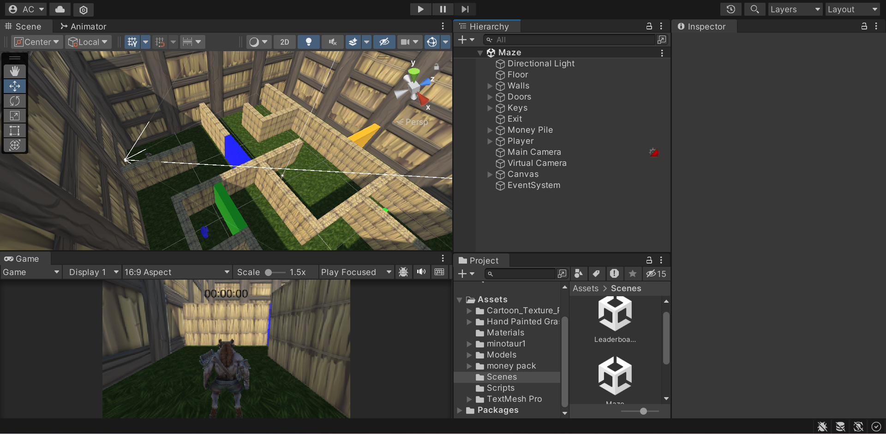
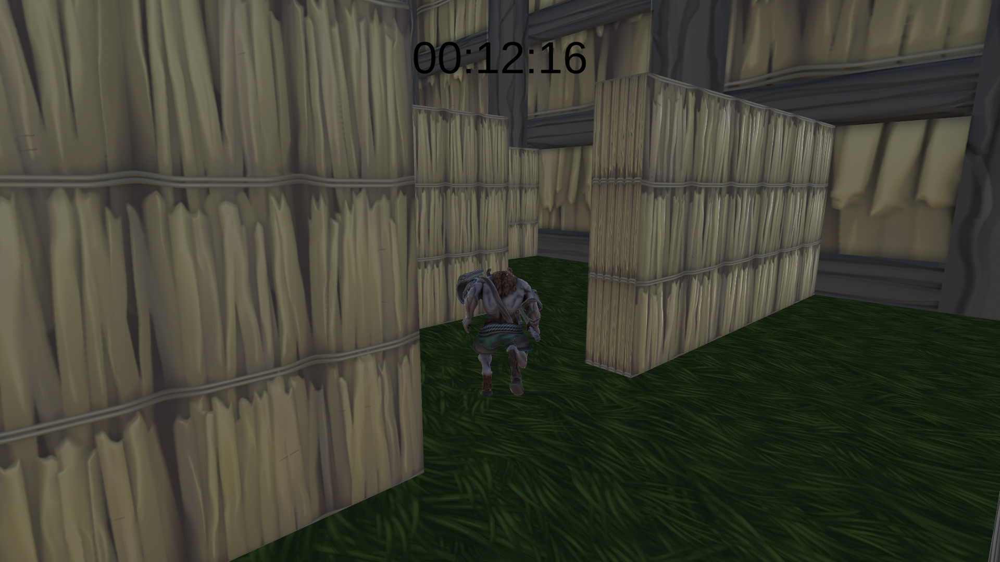

# intro-to-unity
A simple Unity project I made to learn the game engine

## Features
- Main menu, in-game, and leaderboard scenes
- Pause screen and win screen
- 3D models and animation
- Collisions, triggers, etc.

  
  

